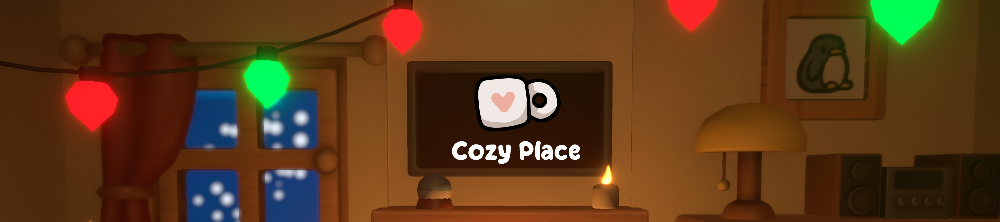
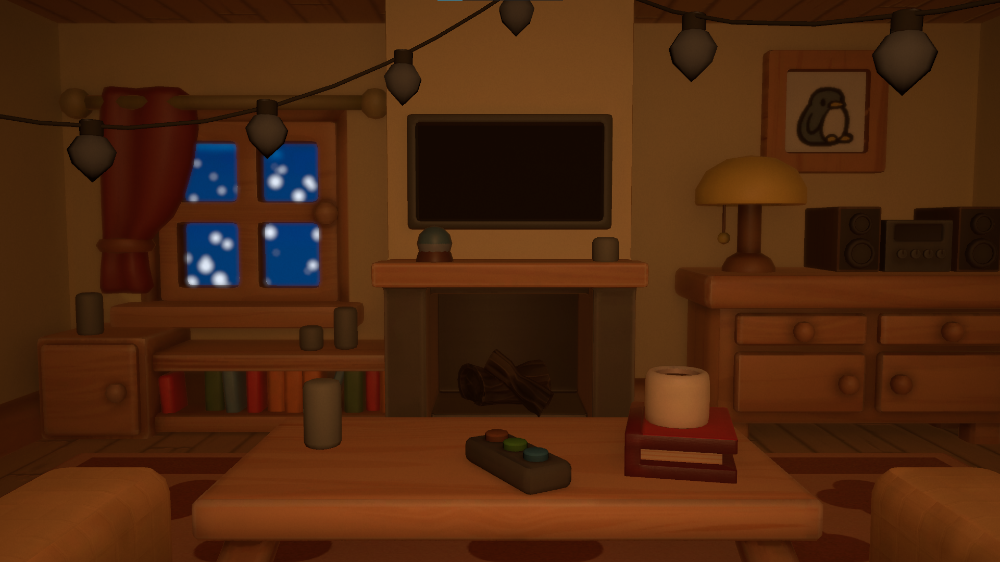
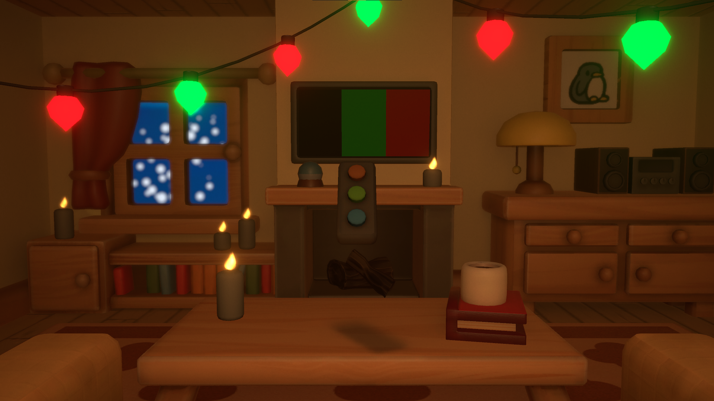

## The project 🚀
Cozy Place is a game jam project that I made with 4 colleagues during my internship at Ubisoft for the [Cozy Winter Jam 2022](https://itch.io/jam/cozy-winter-jam-2022)
The pitch of the game is simple: you come home after a hard day at work and you try to set a perfect cozy atmosphere in your livingroom to relax. To do that, we crafted some riddles and puzzles that you need to solve to improve your cozyness.

You can find the original repository that we use during the jam [here](https://github.com/KokelSan/Cozy-Game-Jam).  
You can play the game on itch.io [here](https://fusshlach.itch.io/cozy-place).

## What I learned 🌟
- I used animation curves for the first time, they really are a nice tool !
- I created a focus tool that allows to bring an interactable object in front of the camera
- I also worked on the global puzzles' architecture

## Gallery 🖼️
|||
:-------------------------:|:-------------------------:
|When the game starts, the atmosphere is not very welcoming nor cozy... |The TV remote controller is an example of a focusable object I worked on|

## Video 🎥
Here is a fast gameplay playthrough of the game:

